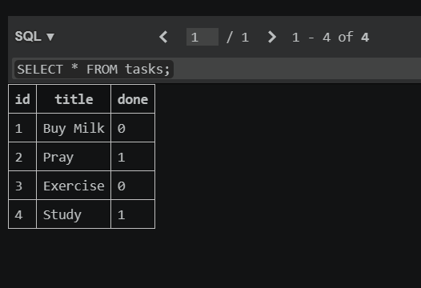
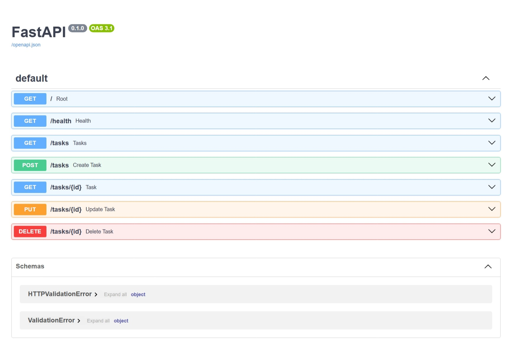
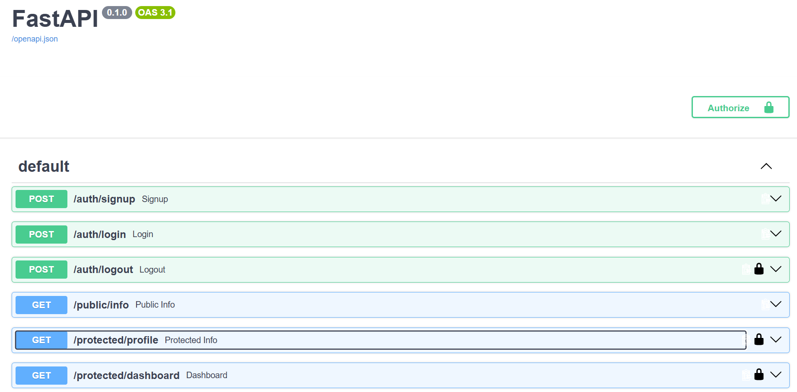

# Task API

A simple REST API built with **Python**, **FastAPI**, and **PostgreSQL** for managing tasks.

This project was built as part of the **FlyRank Backend Internship Track** and demonstrates a complete CRUD API with persistent database storage and a Docker Compose setup.

## Features

- Create a new task
- Get all tasks
- Get a single task by ID
- Update a task
- Delete a task
- PostgreSQL database persistence
- Automatic database initialization and seeding
- Persistent database storage using a Docker volume
- Input validation
- Appropriate HTTP status codes
- Interactive Swagger API documentation
- One-command application and database startup

## Tech Stack

- Python
- FastAPI
- PostgreSQL
- Psycopg
- Uvicorn
- Docker
- Docker Compose
- uv

## Environment Variables

The application uses a `.env` file for environment configuration.

Copy the example file before starting:

```bash
cp .env.example .env
```

The `.env.example` file contains the required variables:

```text
DATABASE_URL=postgres://postgres:dev@db:5432/tasks
```

The `.env` file is git-ignored and should not be committed.

## Database

The application uses a PostgreSQL database managed by Docker Compose.

On startup, the application:

1. Creates the `tasks` table if it does not exist
2. Seeds three example tasks if the table is empty
3. Starts serving requests

The database data is stored in a Docker volume named `taskdata`, allowing data to survive container restarts.

## Installation & Running

### 1. Clone the repository

```bash
git clone https://github.com/NamraAjmal/backend.git
cd backend
```

### 2. Create the environment file

```bash
cp .env.example .env
```

### 3. Start the complete stack

```bash
docker compose up
```

For a fresh image build:

```bash
docker compose up --build
```

The API will be available at:

```text
http://localhost:3000
```

Swagger UI is available at:

```text
http://localhost:3000/docs
```

No manual database setup is required.

## API Endpoints

| Method | Endpoint      | Description                          | Success         |
| ------ | ------------- | ------------------------------------ | --------------- |
| GET    | `/`           | Returns basic API information        | 200             |
| GET    | `/health`     | Checks whether the server is running | 200             |
| GET    | `/tasks`      | Returns all tasks                    | 200             |
| GET    | `/tasks/{id}` | Returns a task by ID                 | 200 / 404       |
| POST   | `/tasks`      | Creates a new task                   | 201             |
| PUT    | `/tasks/{id}` | Updates a task                       | 200 / 400 / 404 |
| DELETE | `/tasks/{id}` | Deletes a task                       | 204 / 404       |

## Example Request

Create a task:

```bash
curl -i -X POST http://localhost:3000/tasks \
-H "Content-Type: application/json" \
-d '{"title":"Learn FastAPI"}'
```

Example response:

```json
{
  "id": 4,
  "title": "Learn FastAPI",
  "done": false
}
```

## Database Verification

PostgreSQL can be inspected using `psql` or a PostgreSQL GUI such as DBeaver, pgAdmin, or TablePlus.

List the tables:

```sql
\dt
```

View the stored tasks:

```sql
SELECT * FROM tasks;
```

### PostgreSQL Screenshot



## Swagger UI

FastAPI automatically generates interactive API documentation using OpenAPI and Swagger UI.

Open:

```text
http://localhost:3000/docs
```

Use the **Try it out** button to create, read, update, and delete tasks directly from the browser.

### Swagger Screenshot




## Project Structure

```text
.
├── main.py
├── database.py
├── Dockerfile
├── compose.yaml
├── pyproject.toml
├── uv.lock
├── .env.example
├── .gitignore
└── README.md
```

## Persistence

Database data is stored in the Docker `taskdata` volume.

To verify persistence:

```bash
docker compose down
docker compose up
```

Tasks created before the restart should still be available.

> Do not use `docker compose down -v` when testing persistence because it removes the database volume.

## Status Codes

The API uses HTTP status codes to communicate request results:

- `200` — Request successful
- `201` — Task successfully created
- `204` — Task successfully deleted
- `400` — Invalid request
- `404` — Task not found
- `422` — Request validation error

## Project Status

- Complete CRUD API
- PostgreSQL database integration
- Automatic database initialization
- Persistent storage across restarts
- Docker Compose full-stack setup
- One-command startup
- Interactive Swagger documentation
